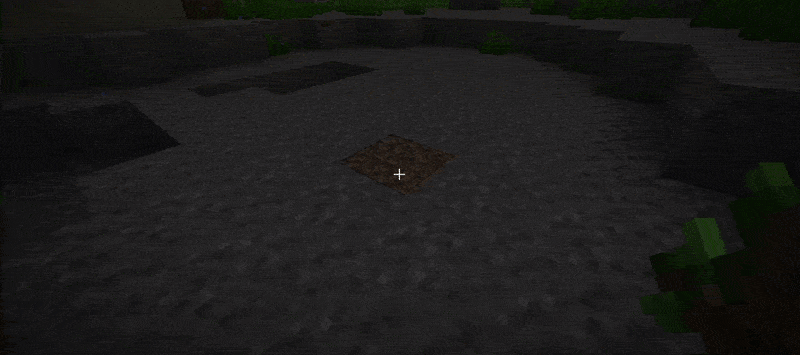

# UnderwaterTrees 🌊

Let your players plant saplings below the surface without weird hacks. UnderwaterTrees keeps placement safe, auto-replants when you want it, and locks configs down so griefing doesn't spiral out of control.

## Why server owners love it

- 🌱 Custom soil + sapling allowlists mean only the trees you approve can grow underwater.
- 🛡️ Stability guard cancels physics + fluid breakage so underwater builds stay intact.
- 💡 Optional light override keeps saplings alive even in deep oceans.
- 🔁 Live reload + config watcher merge new defaults automatically—edit, save, done.
- 🔔 Update checker (Modrinth + Hangar) and join reminders keep your fleet current.
- 🌐 MiniMessage-powered localization lets you style player + console feedback exactly the way you like.

## Requirements

- Paper 26.2 server (Spigot/vanilla forks are not supported; previous Paper versions, incl. 26.1.x, are no longer supported).
- Java 25 runtime.
- Optional: a permissions plugin (LuckPerms, etc.) for fine-grained access to `/timberella` commands.

## Setup in 3 steps

1. Drop `underwatertrees-paper-<version>.jar` into `plugins/`.
2. Start the server once. `config.yml`, `lang/`, and defaults appear under `plugins/UnderwaterTrees/`.
3. Adjust the config (materials, chat prefix, watcher flags) and run `/underwatertrees reload`.

From here the async watcher keeps your external edits synced, and reloads also refresh listeners, locales, and update status.

## Everyday tips

- Use `saplings`/`soils` maps to whitelist exactly what blocks are allowed underwater—unknown materials are ignored safely.
- `protect-underwater-saplings` shields saplings from physics until your placement rules are broken; leave it on for survival worlds.
- Enable `log-detail` temporarily to print a full list of active materials and catch typos fast.
- Set `update-check.notify-console` + `update-check.notify-op-join` to true so updates are surfaced automatically, and flip `update-check.notify-console-always-shown` if you still want no-update provider summaries.
- Metrics (`metrics-enabled`) and update checks (`update-check.enabled`) are opt-out friendly if your policy requires it.

## Supported languages

Underwater Trees bundles each locale as a MiniMessage YAML file so you can recolor or restyle them freely:

- 🇺🇸 English (en_US)
- 🇩🇪 German (de_DE)
- 🇸🇦 Arabic (ar_SA)
- 🇪🇸 Spanish (es_ES)
- 🇫🇷 French (fr_FR)
- 🇮🇹 Italian (it_IT)
- 🇯🇵 Japanese (ja_JP)
- 🇰🇷 Korean (ko_KR)
- 🇳🇱 Dutch (nl_NL)
- 🇵🇱 Polish (pl_PL)
- 🇵🇹 Portuguese (pt_PT)
- 🇹🇷 Turkish (tr_TR)
- 🇺🇦 Ukrainian (uk_UA)
- 🇨🇳 Simplified Chinese (zh_CN)

## Need deeper guidance?

This README keeps things short on purpose. All developer and deep-dive documentation (config matrices, command charts, operations guides) lives in the project wiki. Start there whenever you need advanced workflows or contribution notes.

## License & Credits

- UnderwaterTrees is released under the Apache License 2.0 (see `LICENSE`).
- Third-party components (MiniMessage MIT, bStats MIT, etc.) are acknowledged inside `THIRD_PARTY_LICENSES.md` and the bundled `licenses/` directory.
- Parts of this plugin and documentation were produced with AI assistance (e.g., GitHub Copilot) and reviewed by the maintainer before release.
